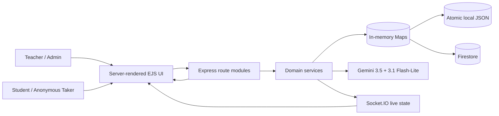
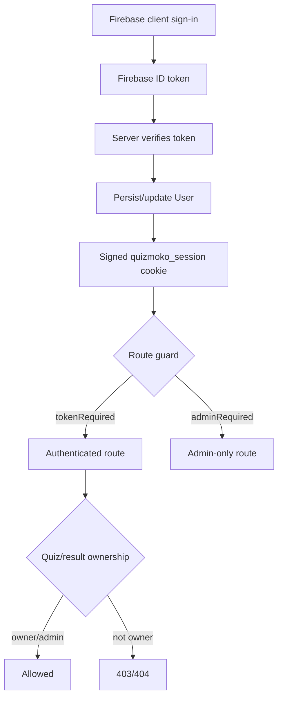
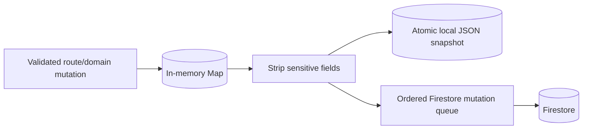
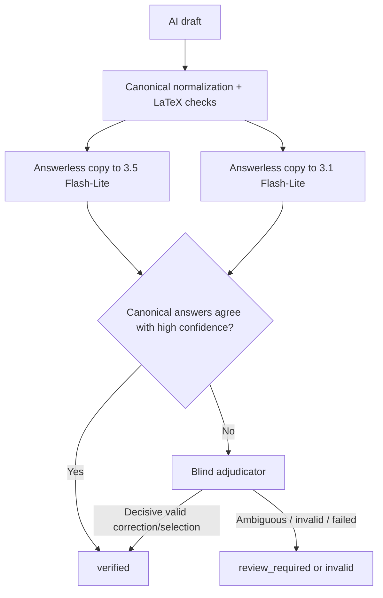
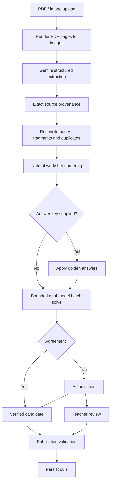

# QuizMoKo Full Application Workflow Map

> **Canonical current-state architecture map**
>
> Baseline: `main` at `cedfb9bbef32c3400b0576b1f843451b448bfcef` (2026-09-03), immediately after PR #1 was merged.
>
> This document describes **what QuizMoKo is and how it currently works**. It is intentionally a map, not a roadmap. Future planning should start from this baseline instead of rediscovering the repository.

The machine-readable companion is [`workflow-map.json`](./workflow-map.json). Update both files whenever a route module, major UI surface, service boundary, persistent store, access rule, or cross-cutting workflow changes.

## 1. System at a glance

QuizMoKo is a server-rendered educational quiz and worksheet platform built on Node.js, TypeScript, Express, EJS, Socket.IO, Firebase Authentication/Firestore, and Gemini Flash-Lite. The application supports manual quiz authoring, AI-assisted authoring, worksheet-to-quiz extraction and solving, public student quiz attempts, live teacher monitoring, deterministic and semantic grading, result sharing/rechecking, and printable worksheet/RMX workflows.



The central architectural rule is that route handlers coordinate work, while reusable correctness-sensitive logic lives in `src/services/`, data state and persistence live in `src/store/db.ts`, and shared domain types live in `src/types.ts`. `server.ts` remains a thin bootstrap.

## 2. Runtime and repository structure

| Layer | Current implementation |
|---|---|
| Runtime | Node.js ESM, `tsx`, supported Node `>=22.13.0 <25` |
| HTTP | Express 4 |
| Rendering | EJS under `views/` |
| Realtime | Socket.IO |
| Auth | Firebase ID tokens converted to signed QuizMoKo session cookies |
| Durable data | Firestore plus local JSON fallback/recovery |
| Hot state | In-memory `Map` stores |
| Hosted AI | Gemini 3.5 Flash-Lite + Gemini 3.1 Flash-Lite |
| Local AI option | Trusted server-configured Ollama endpoint for supported authoring paths |
| PDF/image | `pdfjs-dist`, `sharp`, `multer` |
| Spreadsheet/export | `exceljs`, `archiver` |
| Shared UI | `public/css/quizmoko-ui.css`, `public/js/quizmoko-theme.js`, `public/js/math-display.js` |
| Tests | Node test runner + TypeScript checks + EJS/UI regression checks |

Top-level ownership:

- `server.ts`: middleware, router registration, HTTP/Socket boot.
- `src/routes/`: all HTTP endpoints.
- `src/services/`: grading, AI, worksheet, PDF, realtime, lifecycle, access helpers.
- `src/store/db.ts`: in-memory stores, local persistence, Firestore hydration/sync.
- `src/middleware/`: authentication, error handling, request rate limits.
- `src/types.ts`: canonical shared data contracts.
- `prompts.ts`: AI prompt contracts.
- `views/`: server-rendered application pages with substantial page-specific client JavaScript.
- `public/`: shared CSS, theme and math-display scripts.
- `test/`: domain, HTTP-flow, persistence, PDF, UI and AI-quality regressions.
- `docs/`: architecture and implementation documentation.

## 3. Actors and access boundaries

### Teacher

Authenticated teacher accounts can create and manage their quizzes, run AI authoring, upload/solve worksheets, manage live sessions, inspect results, recheck results, and store a Gemini BYOK key.

### Administrator

Admins inherit teacher capabilities and can also manage users, inspect system health, and export a database snapshot.

### Student

Quiz-taking routes are intentionally public for published quizzes. A signed-in student may have a stable `user_id` attached to a result, but quiz attempts also support unauthenticated students using an opaque browser-generated session ID and result capability token.

### Anonymous quiz taker

Anonymous takers can open published quizzes, grade/save/submit attempts, send live telemetry, and access the result returned for their own opaque session/capability. Teacher authoring, worksheet tools, private quiz details, and administration remain authenticated.

## 4. Server bootstrap

`server.ts` performs only application bootstrapping:

1. Load environment configuration.
2. Create Express + HTTP server.
3. Configure EJS, JSON/form parsing, cookies, static assets, proxy behavior, and request body limit.
4. Register the nine route modules.
5. Create Socket.IO through `src/services/socket.ts`.
6. Install graceful shutdown handlers.
7. Call database initialization before accepting HTTP traffic.
8. Return the API-specific 404/error boundary for unmatched API requests.

`src/services/serverLifecycle.ts` owns startup/shutdown behavior. Startup waits for `initDatabase()`. Shutdown stops HTTP acceptance, closes Socket.IO, drains requests, flushes persistence, and exits non-zero when the drain/flush deadline cannot be met.

## 5. HTTP route map

Routes are mounted through `src/routes/index.ts` in this order: health, auth, quiz, live, grading, AI, results, admin, worksheet.

### Health — `src/routes/healthRoutes.ts`

- `GET /healthz` — public readiness status. Returns 503 when required persistence is not ready.

### Authentication — `src/routes/authRoutes.ts`

- `GET /login`
- `GET /register`
- `GET /api/firebase_config` — safe public Firebase client fields only.
- `GET /logout`
- `POST /api/set_session` — Firebase token flow; UID-only fallback exists only when explicit demo/test auth is enabled.
- `POST /api/login_session` — rate-limited session creation.
- `POST /api/test_login` — demo/test only.
- `POST /api/user/save_api_key` — authenticated teacher/admin API-key storage.

### Quiz ownership and lifecycle — `src/routes/quizRoutes.ts`

- `GET /` — authenticated dashboard.
- `GET /quiz/:quiz_id` — public published quiz-taking page.
- `GET /edit/:quiz_id`, `GET /edit_quiz/:quiz_id` — owner/admin editor.
- `GET /api/quiz/:quiz_id` — public sanitized published quiz JSON.
- `POST /update/:quiz_id`, `POST /api/quiz/:quiz_id/update` — owner/admin canonical update.
- `POST /delete/:quiz_id`, `DELETE /api/quiz/:quiz_id` — delete quiz plus associated results/live state.
- `GET /create_blank` — authenticated blank quiz creation.
- `POST /merge` — merge quizzes the caller can manage.
- `POST /api/move_quiz` — subject move.
- `GET /api/list_quizzes` — owned/manageable quiz list.
- `GET /api/get_quiz_details/:id` — private quiz detail.
- `POST /api/quiz/:quiz_id/duplicate`
- `POST /api/quiz/:quiz_id/folder`

Quiz ownership is admin or matching `quiz.user_id`; legacy unowned records are restricted to the test teacher account. Public quiz payloads remove answer keys, solutions, verification evidence, golden references, and private worksheet source/QA material.

### Live classroom — `src/routes/liveRoutes.ts`

- `GET /live/:quiz_id`, `GET /live` — teacher live view.
- `GET /api/live/:quiz_id` — current live state.
- `POST /api/live/:quiz_id/toggle_pause`
- `POST /api/live/:quiz_id/terminate`
- `POST /api/live/:quiz_id/whiteboard/:sid/toggle`
- `POST /ping` — public HTTP telemetry fallback for a valid quiz/session.

Teacher controls require quiz ownership/admin. Student telemetry is public by design because the quiz-taking page itself is public.

### Authoritative grading — `src/routes/gradingRoutes.ts`

- `POST /api/grade_individual`
- `POST /submit`, `POST /api/submit_quiz`
- `POST /api/save_progressive_result`
- `POST /api/load_progressive_result`
- `POST /api/explain`
- `POST /api/reformat_answer`

These routes form the student attempt state machine. They enforce answer/session revisions, content digests, solution-snapshot limits, deterministic grading first, semantic grading only where required, final attempt serialization, and idempotent final results.

### AI authoring — `src/routes/aiRoutes.ts`

- `GET /api/ai/config`
- `GET /api/ollama_tags`
- `POST /generate_ai`, `POST /api/generate_ai`
- `POST /api/generate_question`
- `POST /api/polish_questions`
- `POST /api/resolve_question`
- `POST /api/transfer_question`
- `POST /api/bulk_import_questions`
- `POST /api/reprocess_question`
- `POST /api/generate_variant`

AI authoring routes are authenticated. Gemini requests pass through the shared AI work guard and per-model rate limiter. AI output is normalized and validated rather than persisted directly.

### Results — `src/routes/resultsRoutes.ts`

- `GET /api/get_result/:result_id`
- `POST /api/results/:result_id/edit_answer` — deliberately disabled for grade-changing writes; returns 409.
- `POST /api/results/:result_id/recheck`
- `POST /api/results/:result_id/reprocess_answers`
- `POST /api/results/:result_id/share_token`
- `POST /api/delete_results`
- `GET /results/:id`
- `GET /solutions/:result_id`, `GET /view_solutions/:quiz_id`

Finalized results are historical records. A teacher recheck uses current authoritative quiz data only after detecting/acknowledging a changed or unknown historical question version, then records regrade audit metadata.

### Administration — `src/routes/adminRoutes.ts`

- `GET /admin`
- `GET /api/admin/system_health`
- `GET /api/admin/export_database`
- `GET /api/admin/users`
- `POST /api/admin/update_user_status`
- `POST /api/install_model` — currently 501; remote Ollama install is unsupported.
- `GET /api/usage/stats` — current placeholder.
- `GET /api/usage/sync_history` — current placeholder.
- `GET /api/progress/:session_id` — current job-progress polling endpoint.

### Worksheet/RMX — `src/routes/worksheetRoutes.ts`

- `POST /api/extract_worksheet`
- `POST /api/solve_worksheet`
- `POST /api/extract_rmxflash`
- `POST /api/export_rmxflash_excel`
- `POST /api/extract_worksheet_with_answers`
- `POST /api/recover_questions`
- `POST /api/generate_quiz_from_extracted`
- `GET /worksheet_answers`
- `GET /worksheet`, `GET /worksheet_upload`
- `GET /rmxflash`
- `GET /worksheet/:quiz_id`

Upload limits are currently 12 files, 20 MB per file, 60 MB total, and at most 100 PDF pages per file. PDF/image uploads are held in memory for extraction and page rasterization.

## 6. UI surface map

| View | Main role |
|---|---|
| `views/index.ejs` | Teacher dashboard, quiz organization and authoring entry points |
| `views/edit_quiz.ejs` | Full quiz editor, verification/re-solve, transfer/import and AI tools |
| `views/quiz.ejs` | Student quiz attempt, timer, answer state, whiteboard, progressive save/grading |
| `views/live.ejs` | Teacher live classroom monitoring/control |
| `views/results.ejs` | Result list/detail and teacher result actions |
| `views/view_solutions.ejs` | Student/teacher solutions and detailed review |
| `views/worksheet_upload.ejs` | Worksheet extraction, review, crop refinement, solving |
| `views/worksheet_answers_upload.ejs` | Worksheet + answer-key workflow |
| `views/worksheet.ejs` | Printable worksheet |
| `views/rmxflash_upload.ejs` | RMX Flash extraction/export |
| `views/admin.ejs` | User/system administration |
| `views/login.ejs` | Firebase sign-in |
| `views/register.ejs` | Firebase registration |

The UI is server-rendered rather than SPA-based. Several pages are large and contain substantial inline JavaScript. Shared browser modules are currently limited to theme behavior and guarded math rendering.

## 7. Canonical domain model

The six canonical question types are:

- `multiple_choice`
- `multiple_choice_multi`
- `true_false`
- `identification`
- `open_ended`
- `graphing`

The grading state machine uses:

- `graded`
- `pending`
- `retryable_error`
- `invalid_response`

Core records:

- `User` — Firebase/app identity and role.
- `Quiz` — owner, metadata, questions, settings and optional draft/verification state.
- `NormalizedQuestion` — canonical type, text, options, answer, points, grading mode, solution and optional provenance/verification.
- `WorksheetQuestionSource` — source file, page, exact printed `original_index`, optional image/crop reference.
- `QuizResult` — attempt identity, canonical answers, revisions, snapshots, graded details, score, timing and result capability hash.
- `LiveSessionState` — process-local teacher/student live state.

## 8. Authentication and authorization flow



`src/middleware/auth.ts` accepts a signed QuizMoKo session cookie or a Firebase ID token. Demo `user_*` identities and automatic test-user fallback are available only in test/explicit demo mode. Blocked users fail authentication.

Firestore browser rules are read-only: browser writes to users/quizzes/results are denied. Validated server routes perform mutations through Firebase Admin where production credentials are available.

## 9. Persistence and durability map

Hot application state is held in:

- `users`
- `quizzes`
- `results`
- `sessionProgress`
- `liveSessions`

The first three are durable domains. `sessionProgress` and `liveSessions` are ephemeral/process-local.

Normal persistence path:



`src/store/db.ts` provides:

- atomic local JSON writes to `data/users.json`, `data/quizzes.json`, `data/results.json`;
- coalesced local save scheduling;
- Firestore hydration;
- ordered per-document mutation queues;
- content-hash write deduplication;
- throttled progressive-result Firestore sync;
- chunk storage for large Firestore documents using `_quizmoko_chunks`;
- explicit persistence health/readiness state;
- database export;
- local recovery paths.

When `REQUIRE_FIRESTORE=true`, QuizMoKo is fail-closed if a credentialed/healthy Firestore backend is unavailable. On Render production, this is intended to be the durable deployment mode.

AI Studio sandbox detection intentionally disables both Firestore and local disk persistence and runs the app in memory only.

## 10. AI architecture

Hosted AI is intentionally limited to:

- `gemini-3.5-flash-lite`
- `gemini-3.1-flash-lite`

`src/services/aiTaskProfiles.ts` defines every hosted AI task centrally. **All current task profiles use `thinkingLevel: high`**, including extraction and LaTeX polish.

Tasks:

1. document extraction
2. answer-key extraction
3. question drafting
4. question solving
5. question adjudication
6. LaTeX polish
7. semantic grading
8. student explanation

Every hosted Gemini call passes through `src/services/geminiRateLimiter.ts`. The default environment contract is 15 RPM per model with one request kept in reserve, so a single server normally starts at most 14 guarded requests per rolling minute per model.

AI authoring also uses `src/services/aiWorkGuard.ts` to constrain request cost/concurrency.

### Fail-closed question verification



A single solver success is never enough. Invalid coverage, broken LaTeX, unresolved disagreement, low confidence, or structural validation failures fail closed.

Golden/teacher answers remain authoritative, but solver disagreement keeps the golden answer and changes the item to teacher review rather than silently replacing it.

## 11. Worksheet-to-quiz flow

Worksheet extraction is one of the most specialized domains in the app.



Important source-identity semantics after the September 3 fix:

- `original_index` is the **exact printed identifier** and must not be rewritten from array position.
- `source_index` is a temporary zero-based solver mapping only.
- `source_file`, page number and `original_index` together provide extraction provenance.
- Repeated printed identifiers on different pages/files are preserved instead of silently losing a question.
- Conflicting same-page duplicate extractions are preserved for review instead of arbitrarily choosing one.
- Downstream canonical publication still requires unique canonical question IDs. A worksheet whose printed numbering genuinely repeats may therefore require explicit disambiguation/review while preserving the printed `original_index`.

`src/services/worksheetSolver.ts` currently limits each model request to 45 seconds, the full solve job to four minutes, and batch worker concurrency to two. Solver output must return exact `source_index` and `source_id` coverage.

## 12. Student attempt and grading flow

```mermaid
flowchart TD
    Q[Public published quiz] --> SID[Cryptographic browser session ID]
    SID --> A[Student answer]
    A --> REV[Increment answer revision + digests]
    REV --> GI[/api/grade_individual]
    GI --> D{Deterministic type?}
    D -->|Yes| L[Local canonical grader]
    D -->|No| SG[Semantic grading]
    L --> P[Progressive result]
    SG --> P
    P --> LIVE[Live score/telemetry]
    P --> SAVE[Progressive save]
    SAVE --> F[Final submit under attempt lock]
    F --> CHECK[Recheck revisions/digests and recompute authoritative grades]
    CHECK --> DB[(Durable QuizResult)]
    DB --> CAP[Return result capability token]
```

Deterministic grading is authoritative for multiple choice, multiple select, true/false and identification. Only semantic question types can require Gemini.

The browser cannot authoritatively set correctness, points, score, correct answer, or final totals.

Question attempt identity includes quiz ID, session ID, question index, answer revision, answer digest, snapshot digest and canonical question digest. Same-revision content changes are rejected. Delayed requests cannot overwrite a newer answer.

Semantic grade proofs are signed against attempt identity. Model/infrastructure failures remain retryable/pending and never become an automatic academic zero.

Final submission is serialized with `withAttemptLock()`, idempotent by session/result ID, and persists the authoritative result before returning success.

## 13. Result access and recheck flow

Final results use a capability token whose raw value is not persisted; only its SHA-256 hash is stored. Normal final submission derives an idempotent HMAC capability from the stable `SESSION_SECRET`, result ID, quiz ID and session ID.

Result access currently recognizes:

1. administrator;
2. matching result `user_id`;
3. quiz owner;
4. valid result capability token;
5. high-entropy legacy capability result IDs;
6. legacy signed-in student name/email matching.

Teacher recheck:

1. locks the attempt;
2. loads the authoritative quiz question;
3. compares the stored historical question digest with current question digest;
4. requires explicit teacher acknowledgement if the version differs or historical digest is missing;
5. loads stored student answer/snapshots;
6. grades deterministically or semantically;
7. writes audit metadata and recalculates the result.

Historical finalized results otherwise remain stable when a quiz is edited later.

## 14. Live classroom flow

Students use Socket.IO with HTTP `/ping` as fallback. `src/services/socket.ts` tracks process-local live sessions, clamps IDs/counters, and uses the persisted progressive result score when one exists instead of trusting the browser score.

Teacher controls can:

- pause/resume a live quiz;
- terminate a live run;
- disable/enable a student's whiteboard.

A student receives per-session updates through `quiz_session_<quizId>_<sessionId>`; the teacher receives quiz-wide updates through `quiz_<quizId>`.

## 15. Security and secret boundaries

- Firebase ID tokens are verified server-side.
- Production sessions are HMAC-signed with `SESSION_SECRET`.
- `SESSION_SECRET` should be at least 32 characters and stable across restarts.
- Student request bodies have AI-key fields stripped centrally.
- Public/student grading resolves Gemini from the authoritative quiz creator's server-side profile or environment, never from student-supplied keys.
- Request-scoped credential fields are recursively stripped before persistence.
- Public quiz payloads remove answers and private verification/provenance.
- Browser Firestore writes are denied by `firestore.rules`.
- Result access tokens are hash-only at rest.
- File uploads are type/size bounded.

## 16. Environment/deployment contract

Key environment controls from `.env.example`:

| Setting | Role |
|---|---|
| `GEMINI_API_KEY` / legacy `API_KEY` | Hosted Gemini |
| `GEMINI_FLASH_LITE_RPM` | Per-model quota assumption |
| `GEMINI_FLASH_LITE_RPM_RESERVE` | Reserved quota |
| `GEMINI_RATE_LIMIT_*` | Rolling-window queue behavior |
| `OLLAMA_BASE_URL`, `OLLAMA_ALLOWED_BASE_URLS` | Trusted local AI |
| `SESSION_SECRET` | Session/result capability signing |
| `COOKIE_SECURE`, `TRUST_PROXY` | Deployment cookie/proxy behavior |
| `ALLOW_DEMO_AUTH` | Explicit sandbox/test auth only |
| `FIREBASE_*` / `GOOGLE_APPLICATION_CREDENTIALS` | Firebase Admin |
| `REQUIRE_FIRESTORE` | Fail-closed durable persistence |
| `FIREBASE_WEB_FALLBACK` | Legacy web-SDK persistence fallback |
| `QUIZMOKO_DATA_DIR` | Local JSON path |
| `MAX_REQUEST_BODY_SIZE` | Express body limit |

### Scaling boundary

Several correctness mechanisms are process-local:

- attempt locks;
- answer-revision high-water identities;
- live session state;
- request rate-limit maps;
- Gemini rolling-window queues;
- AI work concurrency state.

Therefore the current architecture is intentionally **one writable QuizMoKo server process**. Horizontal write scaling would require shared/distributed replacements for those mechanisms.

## 17. Test and verification map

`npm test` runs:

- `test/quiz-flows.test.ts`
- `test/persistence-ordering.test.ts`
- `test/firestore-required-startup.test.ts`
- `test/pdf-service.test.ts`
- `test/ui-consistency.test.ts`
- `test/ai-quality.test.ts`

Other checks:

- `npm run check` — TypeScript.
- `npm run build` — check + typecheck.
- `npm run eval:ai` — live AI gold evaluation using `scripts/evaluate-ai-quality.ts`.

The merged worksheet-numbering baseline was verified immediately before merge with **126 tests passed, 0 failed**, build passing, `git diff --check` passing, and changed worksheet EJS templates passing EJS lint.

## 18. Current boundaries and known issues

These are recorded so future planning starts from reality. They are **not** a prioritized roadmap.

| Area | Current boundary |
|---|---|
| Result privacy | Legacy result authorization still allows signed-in `student_name` matching against account name/email in addition to UID/capability checks. |
| Job progress | `GET /api/progress/:session_id` is public; worksheet client solve-session IDs still include a `Math.random()` path. |
| Socket boundary | Socket.IO currently uses CORS `origin: "*"`. |
| Horizontal scaling | Attempt/revision/rate/live/AI coordination is process-local. |
| Frontend maintainability | Several EJS pages are very large and contain extensive inline JavaScript. |
| Persistence complexity | Memory + local JSON + Firestore provide resilience but require careful ordering/health semantics. |
| Admin completeness | Usage stats/history are placeholders and remote model installation is intentionally unsupported. |
| Dependency health | The PR #1 clean install reported 10 moderate and 3 high npm audit findings; no blind `--force` upgrade was applied. |
| Historical docs | `docs/IMPLEMENTATION_REPORT.md` is a point-in-time August report, not the canonical current app map. |

## 19. Canonical invariants for future work

1. Never trust browser-supplied grading authority.
2. Never publish answer/solution/verification evidence through public quiz payloads.
3. Keep AI generation fail-closed.
4. Keep all hosted Gemini calls behind the shared per-model limiter.
5. Keep all AI task profiles centralized.
6. Preserve worksheet `original_index` exactly; never derive it from array position.
7. Treat repeated printed worksheet IDs as provenance that may need publication-time disambiguation, not as permission to silently delete a question.
8. Preserve attempt revision/digest ordering and final idempotency.
9. Keep result capabilities raw-token-free at rest.
10. Keep `SESSION_SECRET` stable and retain the single-writable-process boundary.
11. Keep `server.ts` thin and route/domain/persistence responsibilities separated.
12. Update this Markdown map and `workflow-map.json` whenever the architecture materially changes.

## 20. Documentation authority

For current architecture questions, use this order:

1. Current code on `main`.
2. `docs/architecture/workflow-map.json` for the canonical machine-readable map.
3. This `APP_WORKFLOW_MAP.md` for the canonical human-readable explanation.
4. `AGENTS.md` for non-regression rules and implementation conventions.
5. `docs/AI_QUALITY.md` for detailed AI-quality policy.
6. `docs/IMPLEMENTATION_REPORT.md` and `AGENT_EVOLUTION_LOG.md` as historical records.

If code and documentation disagree, the code is authoritative and the two architecture map files should be corrected in the same change.
